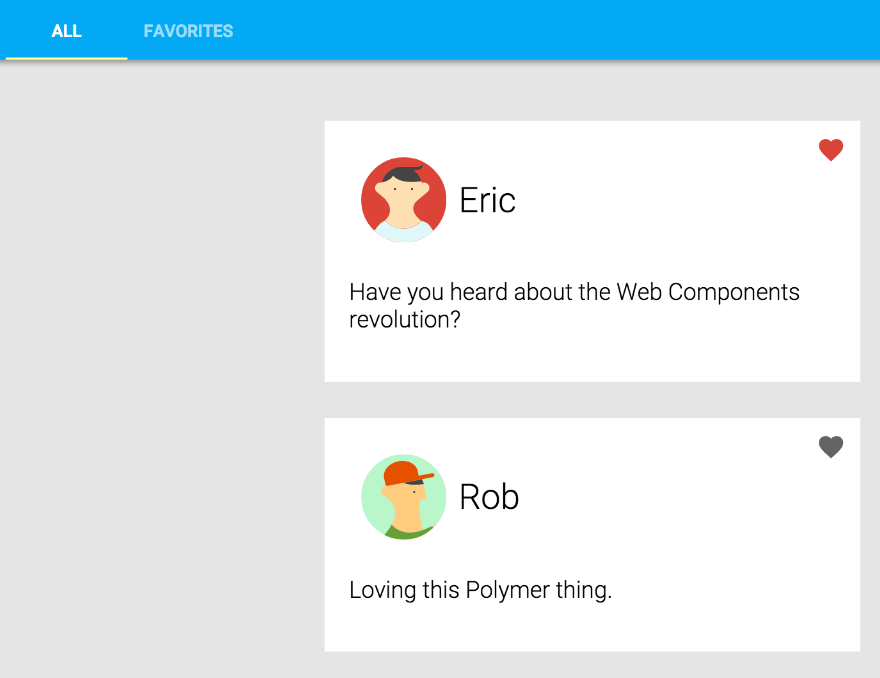

# Polymer Starter Project

This project includes a set of Polymer components and a starter project.

In this tutorial, I've build a simple client for the read-only social networking service.


## Project contents

 -    Scaffolding for the starter project. If you're working through the tutorial, start here!
 -   `components`. Selection of Polymer elements used in the project.
 -   `post-service`. A pre-built element that implements an interface to the `unquote` service. 
 -   `api`. Data for the the `unquote` service.
 -   `images`. Avatar images.

## To run project locally

execute:

```
bower install
```
```
npm install
```

and then 
```
npm start 
```

You should see:



